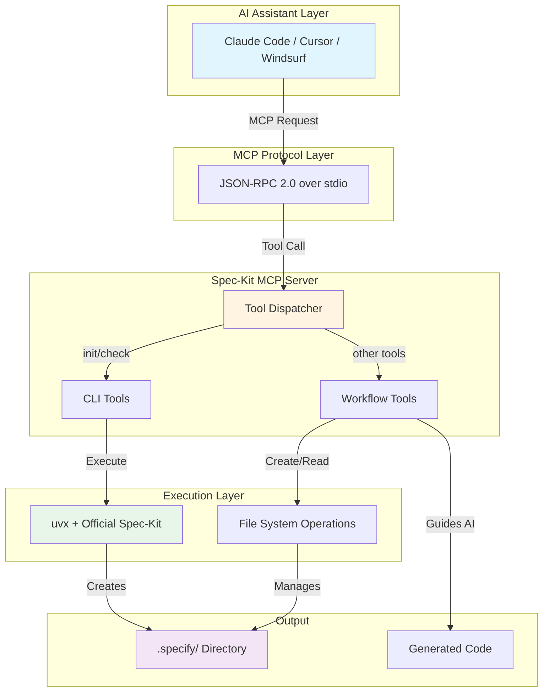
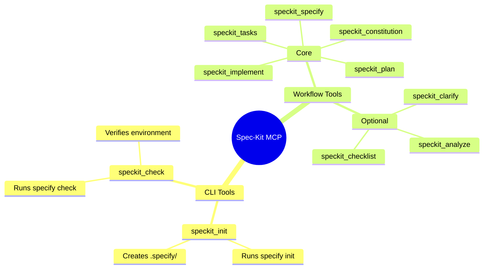
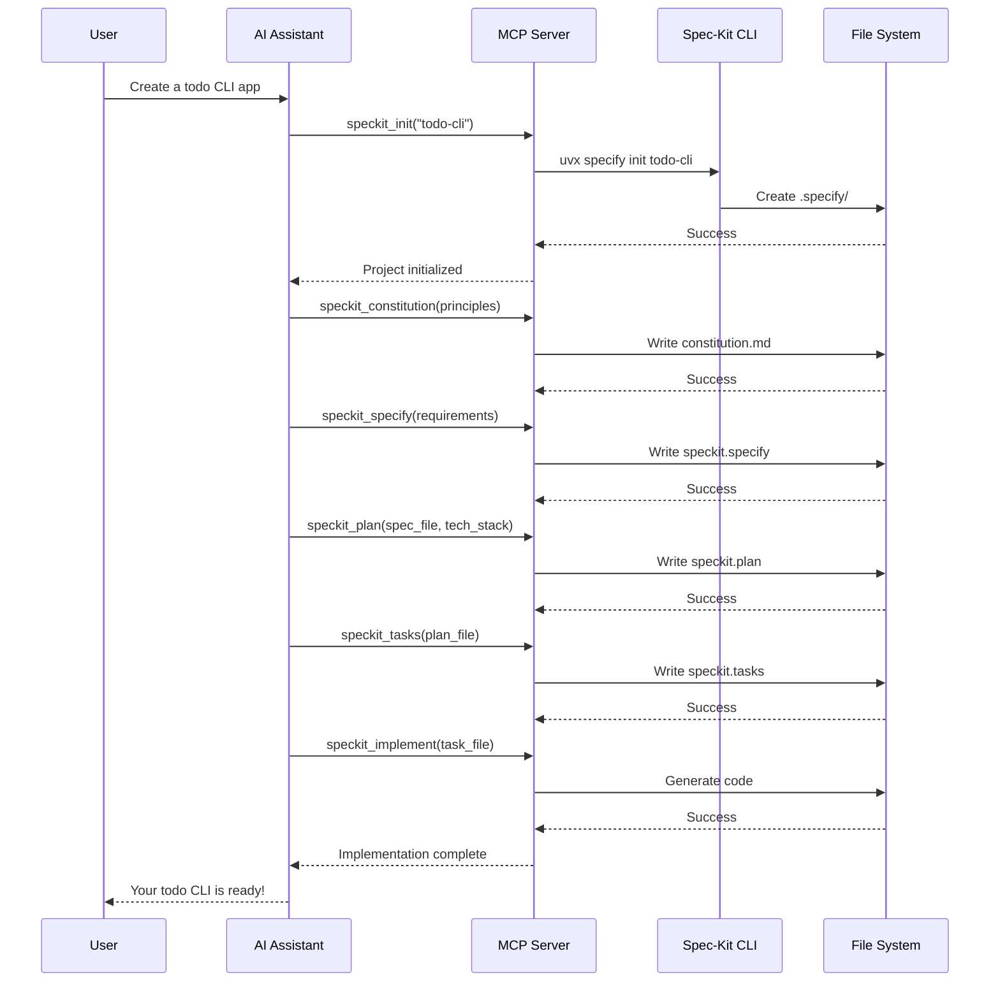
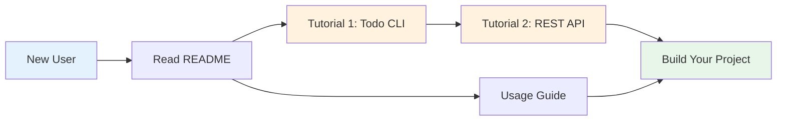

<div align="center">

# 🎯 Spec-Kit MCP Server

**Bridge AI Assistants with GitHub's Official Spec-Kit**

[](LICENSE-MIT)
[](https://www.rust-lang.org)
[](https://modelcontextprotocol.io/)

_Seamlessly integrate spec-driven development into your AI coding workflow_

[Features](#-features) • [Quick Start](#-quick-start) • [Architecture](#-architecture) • [Documentation](#-documentation)

</div>

---

## 🌟 Features

<table>
<tr>
<td width="50%">

### 🔌 **MCP Integration**

- Full JSON-RPC 2.0 protocol support
- Works with Claude Code, Cursor, Windsurf
- 10 structured tools for complete workflow

</td>
<td width="50%">

### ⚡ **Official Spec-Kit**

- Direct integration via `uvx`
- No separate installation needed
- Always uses latest from GitHub

</td>
</tr>
<tr>
<td width="50%">

### 🚀 **High Performance**

- Built with Rust + Tokio
- Async I/O throughout
- <100ms cold start

</td>
<td width="50%">

### 🛡️ **Production Ready**

- Comprehensive error handling
- Full test coverage
- Type-safe implementation

</td>
</tr>
</table>

---

## 📋 Prerequisites

```bash
# 1. Install uv (Python package manager)
curl -LsSf https://astral.sh/uv/install.sh | sh

# 2. Verify installation
uvx --version

# 3. That's it! Spec-kit will be auto-downloaded on first use
```

**Requirements:**

- `uv` package manager
- Python 3.11+ (usually pre-installed)
- Git (for version control)

---

## 🚀 Quick Start

### Installation

```bash
# Clone and build
git clone https://github.com/yourusername/spec-kit-mcp.git
cd spec-kit-mcp
cargo build --release

# Binary location: target/release/spec-kit-mcp
```

### Configuration

Add to your MCP client config (e.g., `~/.config/claude-code/mcp.json`):

```json
{
  "mcpServers": {
    "spec-kit": {
      "command": "/path/to/spec-kit-mcp/target/release/spec-kit-mcp",
      "args": [],
      "env": {}
    }
  }
}
```

### First Steps

```
1. Ask your AI: "Use speckit_check to verify my environment"
2. Ask your AI: "Use speckit_init to create a new project called 'my-app'"
3. Start building with spec-driven development!
```

---

## 🏗️ Architecture

### System Overview



### Workflow Process

```mermaid
flowchart LR
    subgraph "Phase 1: Setup"
        A[speckit_init] --> B[speckit_check]
    end

    subgraph "Phase 2: Define"
        C[speckit_constitution] --> D[speckit_specify]
        D --> E[speckit_clarify]
    end

    subgraph "Phase 3: Plan"
        E --> F[speckit_plan]
        F --> G[speckit_analyze]
    end

    subgraph "Phase 4: Execute"
        G --> H[speckit_tasks]
        H --> I[speckit_checklist]
        I --> J[speckit_implement]
    end

    B --> C

    style A fill:#4CAF50
    style C fill:#2196F3
    style F fill:#FF9800
    style J fill:#9C27B0
```



### Tool Categories



---

## 🛠️ Available Tools

### Core Workflow (Required)

| Tool                     | Purpose                | Output                |
| ------------------------ | ---------------------- | --------------------- |
| **speckit_init**         | Initialize project     | `.specify/` structure |
| **speckit_check**        | Verify environment     | Status report         |
| **speckit_constitution** | Define principles      | `constitution.md`     |
| **speckit_specify**      | Define requirements    | `speckit.specify`     |
| **speckit_plan**         | Create technical plan  | `speckit.plan`        |
| **speckit_tasks**        | Generate task list     | `speckit.tasks`       |
| **speckit_implement**    | Execute implementation | Generated code        |

### Quality Enhancement (Optional)

| Tool                  | Purpose              | When to Use                 |
| --------------------- | -------------------- | --------------------------- |
| **speckit_clarify**   | Identify ambiguities | Before planning             |
| **speckit_analyze**   | Check consistency    | After tasks                 |
| **speckit_checklist** | Generate validation  | Before/after implementation |

---

## 📊 Usage Example

### Complete Workflow



### Real Conversation

```
👤 User: Create a todo CLI app with add, list, and complete commands

🤖 AI: I'll help you build that using spec-driven development.

    [Uses speckit_init]
    ✅ Project initialized

    [Uses speckit_constitution]
    ✅ Principles: Simplicity, CLI-first, No dependencies

    [Uses speckit_specify]
    ✅ Requirements defined with user stories

    [Uses speckit_plan]
    ✅ Technical plan: Python + argparse + JSON storage

    [Uses speckit_tasks]
    ✅ 8 actionable tasks generated

    [Uses speckit_implement]
    ✅ Implementation complete!

👤 User: Perfect! Let me test it.

$ python todo.py add "Learn spec-kit"
$ python todo.py list
1. [ ] Learn spec-kit
```

---

## 📁 Project Structure

After initialization, your project will have:

```
my-project/
├── .specify/
│   ├── memory/
│   │   └── constitution.md      # Project principles
│   ├── specs/
│   │   └── 001-feature/
│   │       ├── spec.md          # Requirements
│   │       ├── plan.md          # Technical plan
│   │       └── tasks.md         # Task breakdown
│   └── templates/               # Spec-kit templates
├── speckit.specify              # Current specification
├── speckit.plan                 # Current plan
├── speckit.tasks                # Current tasks
└── src/                         # Your implementation
```

---

## 🎓 Documentation

### Quick Links

- **[📖 Tutorials](./TUTORIALS.md)** - Step-by-step guides
- **[📚 Usage Guide](./USAGE_GUIDE.md)** - Complete tool reference
- **[🔗 Official Spec-Kit](https://github.com/github/spec-kit)** - GitHub's spec-kit

### Learning Path



---

## 🔧 Development

### Build & Test

```bash
# Run tests
cargo test

# Check code quality
cargo clippy

# Format code
cargo fmt

# Build release
cargo build --release
```

### Project Structure

```
spec-kit-mcp/
├── src/
│   ├── main.rs              # Binary entry point
│   ├── lib.rs               # Library root
│   ├── mcp/                 # MCP protocol
│   │   ├── protocol.rs      # JSON-RPC handler
│   │   ├── server.rs        # MCP server
│   │   ├── transport.rs     # stdio transport
│   │   └── types.rs         # Protocol types
│   ├── speckit/             # Spec-kit integration
│   │   ├── cli.rs           # CLI executor
│   │   └── errors.rs        # Error types
│   └── tools/               # MCP tools
│       ├── init.rs          # CLI: init
│       ├── check.rs         # CLI: check
│       ├── constitution.rs  # Workflow tool
│       ├── specify.rs       # Workflow tool
│       ├── plan.rs          # Workflow tool
│       ├── tasks.rs         # Workflow tool
│       ├── implement.rs     # Workflow tool
│       ├── clarify.rs       # Workflow tool
│       ├── analyze.rs       # Workflow tool
│       └── checklist.rs     # Workflow tool
├── Cargo.toml
└── README.md
```

---

## 🐛 Troubleshooting

### Common Issues

<details>
<summary><b>❌ Error: spec-kit CLI not found!</b></summary>

**Solution:**

```bash
# Install uv
curl -LsSf https://astral.sh/uv/install.sh | sh

# Verify
uvx --version
```

</details>

<details>
<summary><b>⏱️ First run is slow</b></summary>

**This is normal!** `uvx` downloads and caches spec-kit on first use (~5-10 seconds). Subsequent runs are fast (<1 second).

</details>

<details>
<summary><b>📁 Error: .specify directory not found</b></summary>

**Solution:** Run `speckit_init` first to initialize the project structure.

</details>

---

## 🤝 Contributing

Contributions are welcome! Please:

1. Fork the repository
2. Create a feature branch
3. Make your changes
4. Run tests: `cargo test`
5. Submit a pull request

---

## 📄 License

This project is dual-licensed under:

- **MIT License** - See [LICENSE-MIT](LICENSE-MIT)
- **Apache License 2.0** - See [LICENSE-APACHE](LICENSE-APACHE)

Choose the license that best suits your needs.

---

## 🙏 Acknowledgments

- **[GitHub Spec-Kit](https://github.com/github/spec-kit)** - The official spec-driven development toolkit
- **[Model Context Protocol](https://modelcontextprotocol.io/)** - Enabling AI-tool integration
- **[uv](https://docs.astral.sh/uv/)** - Fast Python package manager
- **Rust Community** - For excellent async tooling

---

<div align="center">

**Built with ❤️ using Rust**

[⬆ Back to Top](#-spec-kit-mcp-server)

</div>
