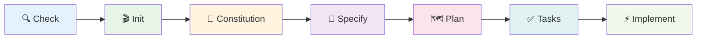
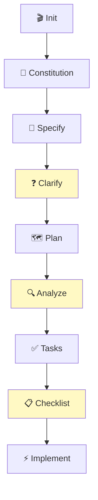
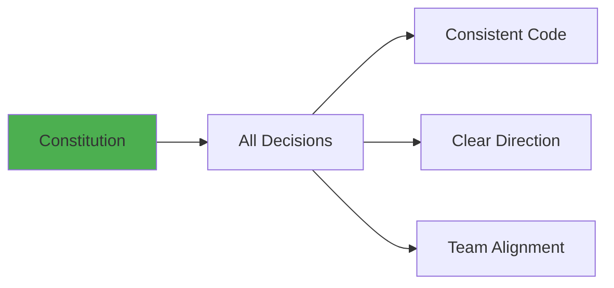
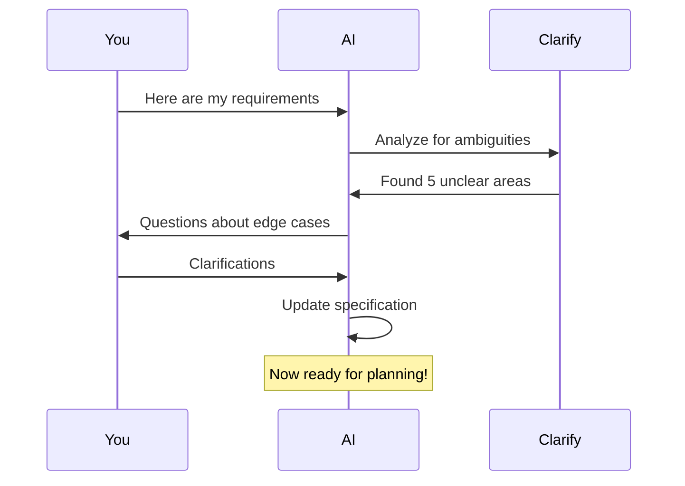
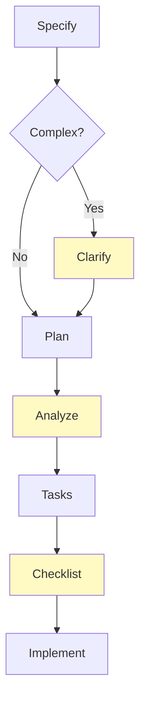
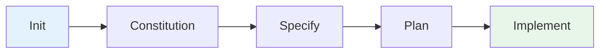
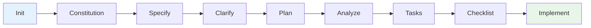
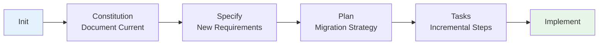
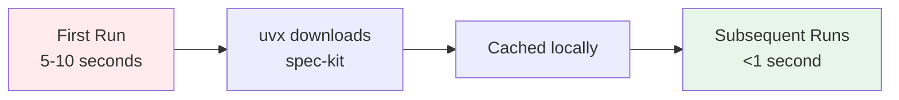

<div align="center">

# 🎓 Spec-Kit MCP Tutorials

**Master Spec-Driven Development with AI Assistants**

_From zero to production-ready applications_

[Tutorial 1](#-tutorial-1-your-first-spec-kit-project) • [Tutorial 2](#-tutorial-2-building-a-rest-api) • [Tutorial 3](#-tutorial-3-working-with-existing-projects) • [Best Practices](#-best-practices)

</div>

---

## 📚 Table of Contents

- [Prerequisites](#-prerequisites)
- [Tutorial 1: Your First Spec-Kit Project](#-tutorial-1-your-first-spec-kit-project)
- [Tutorial 2: Building a REST API](#-tutorial-2-building-a-rest-api)
- [Tutorial 3: Working with Existing Projects](#-tutorial-3-working-with-existing-projects)
- [Best Practices](#-best-practices)
- [Common Workflows](#-common-workflows)
- [Troubleshooting](#-troubleshooting)

---

## 🎯 Prerequisites

<table>
<tr>
<td width="33%">

### 🤖 AI Assistant

- Claude Code
- Cursor
- Windsurf
- Any MCP-compatible client

</td>
<td width="33%">

### 🔧 Tools

- `uv` package manager
- Python 3.11+
- Git

</td>
<td width="33%">

### ⚙️ Setup

- MCP server configured
- AI assistant connected
- Ready to code!

</td>
</tr>
</table>

---

## 🚀 Tutorial 1: Your First Spec-Kit Project

<div align="center">

**Build a Todo CLI Application**

_Time: 15-20 minutes_ | _Difficulty: Beginner_ | _Output: Working CLI app_

</div>

### 📋 What You'll Build

A command-line todo application with:

- ✅ Add tasks
- 📝 List all tasks
- ✔️ Mark tasks complete
- 🗑️ Delete tasks
- 💾 Persist to file

### 🗺️ Workflow Overview



---

### Step 1: Verify Environment

**Ask your AI assistant:**

```
Use speckit_check to verify my development environment
```

**Expected Output:**

```
✅ uv/uvx is available
✅ git is available
✅ All required tools are installed!

You're ready to use spec-kit for spec-driven development.
```

<details>
<summary>💡 What's happening?</summary>

The MCP server runs `uvx specify check` to verify:

- `uv`/`uvx` is installed
- Git is available
- Your environment is ready
</details>

---

### Step 2: Initialize Project

**Ask your AI assistant:**

```
Use speckit_init to create a new project called "todo-cli" in the current directory
```

**Expected Output:**

```
Successfully initialized spec-kit project 'todo-cli' at .

Next steps:
1. Navigate to the project: cd .
2. Create constitution: Use speckit_constitution tool
3. Define requirements: Use speckit_specify tool
```

**What was created:**

```
todo-cli/
└── .specify/
    ├── memory/
    ├── scripts/
    ├── specs/
    └── templates/
```

---

### Step 3: Define Project Principles

**Ask your AI assistant:**

```
Use speckit_constitution to create project principles:

Principles:
- Simplicity: Keep the code simple and readable
- CLI-first: Focus on command-line interface
- No external dependencies: Use only standard library
- User-friendly: Clear error messages and help text

Constraints:
- Must work on Python 3.11+
- Single file implementation
- No database required
```

**Output:** Creates `.specify/memory/constitution.md`

```markdown
# Project Constitution

## Core Principles

Simplicity: Keep the code simple and readable
CLI-first: Focus on command-line interface
No external dependencies: Use only standard library
User-friendly: Clear error messages and help text

## Technical Constraints

Must work on Python 3.11+
Single file implementation
No database required
```

---

### Step 4: Specify Requirements

**Ask your AI assistant:**

```
Use speckit_specify to define requirements:

Requirements:
- Add tasks with a description
- List all tasks with their status
- Mark tasks as complete
- Delete tasks by ID
- Persist tasks to a JSON file
- Show task count and completion percentage

User Stories:
- As a user, I want to add tasks so I can track my work
- As a user, I want to list tasks so I can see what needs to be done
- As a user, I want to mark tasks complete so I can track progress
- As a user, I want to delete tasks so I can remove completed or unwanted items
- As a user, I want my tasks to persist so I don't lose them when I close the app
```

**Output:** Creates `./speckit.specify`

---

### Step 5: Create Technical Plan

**Ask your AI assistant:**

```
Use speckit_plan with:
- spec_file: ./speckit.specify
- tech_stack: Python with argparse for CLI, JSON for storage

Create a simple architecture with:
- CLI argument parser using argparse
- Task manager class to handle CRUD operations
- JSON file for persistence (tasks.json)
- Clear separation of concerns
```

**Output:** Creates `./speckit.plan`

**Plan includes:**

- 📐 Architecture design
- 🛠️ Technology choices
- 📦 Module breakdown
- 🔄 Data flow

---

### Step 6: Generate Task List

**Ask your AI assistant:**

```
Use speckit_tasks with:
- plan_file: ./speckit.plan
- breakdown_level: medium

Break down the implementation into clear, actionable tasks
```

**Output:** Creates `./speckit.tasks`

**Sample tasks:**

```markdown
## Tasks

### Phase 1: Core Structure

- [ ] Create Task class with id, description, completed fields
- [ ] Implement TaskManager class with CRUD methods
- [ ] Add JSON persistence layer

### Phase 2: CLI Interface

- [ ] Set up argparse with subcommands
- [ ] Implement 'add' command
- [ ] Implement 'list' command
- [ ] Implement 'complete' command
- [ ] Implement 'delete' command

### Phase 3: Polish

- [ ] Add error handling
- [ ] Add help text
- [ ] Add statistics display
```

---

### Step 7: Implement

**Ask your AI assistant:**

```
Use speckit_implement with:
- task_file: ./speckit.tasks
- output_dir: ./

Implement all tasks according to the plan. Follow the constitution principles.
```

**The AI will now:**

1. 📖 Read the task list
2. 💻 Generate code for each task
3. ✅ Follow the constitution
4. 🎨 Apply best practices

---

### Step 8: Test Your Application

```bash
# Add some tasks
python todo.py add "Learn spec-kit"
python todo.py add "Build awesome app"
python todo.py add "Deploy to production"

# List tasks
python todo.py list
# Output:
# 1. [ ] Learn spec-kit
# 2. [ ] Build awesome app
# 3. [ ] Deploy to production
#
# Total: 3 tasks | Completed: 0 (0%)

# Complete a task
python todo.py complete 1

# List again
python todo.py list
# Output:
# 1. [✓] Learn spec-kit
# 2. [ ] Build awesome app
# 3. [ ] Deploy to production
#
# Total: 3 tasks | Completed: 1 (33%)

# Delete a task
python todo.py delete 2

# Success! 🎉
```

---

### 🎊 Congratulations!

You've just built your first application using spec-driven development!

**What you learned:**

- ✅ How to initialize a spec-kit project
- ✅ How to define principles and requirements
- ✅ How to create technical plans
- ✅ How to generate and execute tasks
- ✅ The complete spec-driven workflow

---

## 🌐 Tutorial 2: Building a REST API

<div align="center">

**Build a Blog API with FastAPI**

_Time: 30-40 minutes_ | _Difficulty: Intermediate_ | _Output: Production-ready API_

</div>

### 📋 What You'll Build

A RESTful blog API with:

- 📝 Create, read, update, delete posts
- 🔍 Search and pagination
- 💾 SQLite database
- ✅ Input validation
- 📚 API documentation

### 🗺️ Enhanced Workflow



_Yellow boxes = Optional quality enhancement steps_

---

### Step 1: Initialize

```
Use speckit_init to create a new project called "blog-api"
```

---

### Step 2: Constitution

```
Use speckit_constitution with principles:

Principles:
- RESTful design: Follow REST principles strictly
- Security: Validate all inputs, sanitize outputs
- Performance: Optimize database queries
- Testing: Write tests for all endpoints
- Documentation: Auto-generate API docs

Constraints:
- Must use FastAPI framework
- SQLite for development, PostgreSQL-ready for production
- Pydantic for validation
- Follow OpenAPI 3.0 specification
```

---

### Step 3: Specify Requirements

```
Use speckit_specify to define a blog API with:

Requirements:
- CRUD operations for blog posts
- Each post has: title, content, author, created_at, updated_at
- List posts with pagination (10 per page)
- Search posts by title or content
- Filter posts by author
- Soft delete (mark as deleted, don't remove)
- Return proper HTTP status codes
- Include request/response validation

User Stories:
- As an API client, I want to create posts so I can publish content
- As an API client, I want to list all posts with pagination
- As an API client, I want to search posts by keywords
- As an API client, I want to update my posts
- As an API client, I want to delete posts
- As an API client, I want to filter posts by author
```

---

### Step 4: Clarify (Optional but Recommended)

```
Use speckit_clarify with:
- spec_file: ./speckit.specify

Identify any ambiguous requirements that need clarification
```

**AI will ask questions like:**

- Should search be case-sensitive?
- What's the maximum content length?
- Should we support markdown in content?
- How should we handle duplicate titles?

**Answer these to refine your spec!**

---

### Step 5: Create Plan

```
Use speckit_plan with:
- spec_file: ./speckit.specify
- tech_stack: FastAPI with SQLAlchemy and SQLite

Include:
- FastAPI application structure
- SQLAlchemy models with relationships
- Pydantic schemas for request/response validation
- CRUD operations with proper error handling
- Pagination logic with offset/limit
- Search functionality with SQL LIKE
- Soft delete implementation
```

---

### Step 6: Analyze (Optional)

```
Use speckit_analyze with:
- project_path: .

Check that constitution, spec, plan, and tasks are all aligned
```

**Output:**

```
✅ Constitution principles are reflected in the plan
✅ All requirements from spec are covered in plan
✅ Technical constraints are satisfied
⚠️  Consider adding rate limiting (not in requirements)
```

---

### Step 7: Generate Tasks

```
Use speckit_tasks with:
- plan_file: ./speckit.plan
- breakdown_level: detailed
```

**Output:** Detailed task breakdown with dependencies

---

### Step 8: Generate Checklist (Optional)

```
Use speckit_checklist with:
- spec_file: ./speckit.specify

Generate a validation checklist to ensure all requirements are met
```

**Output:** Quality checklist for validation

---

### Step 9: Implement

```
Use speckit_implement with:
- task_file: ./speckit.tasks
- output_dir: ./app
- context: Follow FastAPI best practices, use async/await
```

---

### Step 10: Test Your API

```bash
# Start the server
uvicorn app.main:app --reload

# Create a post
curl -X POST http://localhost:8000/posts \
  -H "Content-Type: application/json" \
  -d '{"title":"My First Post","content":"Hello World!","author":"John"}'

# List posts
curl http://localhost:8000/posts

# Search posts
curl http://localhost:8000/posts/search?q=First

# View API docs
open http://localhost:8000/docs
```

---

## 🔄 Tutorial 3: Working with Existing Projects

<div align="center">

**Add Spec-Kit to Your Current Project**

_Time: 10-15 minutes_ | _Difficulty: Beginner_

</div>

### Scenario

You have an existing project and want to add a new feature using spec-driven development.

### Steps

#### 1. Navigate to Your Project

```bash
cd /path/to/your/existing/project
```

#### 2. Initialize Spec-Kit

```
Use speckit_init with:
- project_name: my-existing-project
- project_path: .
```

This creates `.specify/` without affecting your existing code.

#### 3. Document Current State

```
Use speckit_constitution to document:

Current State:
- Existing architecture: [describe]
- Current tech stack: [list]
- Code patterns: [describe]
- Technical debt: [list issues]

Principles for New Features:
- Consistency: Match existing code style
- Compatibility: Don't break existing features
- Testing: Add tests for new code
```

#### 4. Define New Feature

```
Use speckit_specify to define the new feature you want to add

Requirements:
[Your new feature requirements]

User Stories:
[Your user stories]
```

#### 5. Continue Normal Workflow

Follow the standard workflow:

- Plan → Tasks → Implement

The AI will respect your existing codebase and constitution!

---

## 💡 Best Practices

### 🎯 1. Start with Constitution



**Why:** It guides every subsequent decision and keeps your project consistent.

---

### 📝 2. Be Specific in Requirements

<table>
<tr>
<th>❌ Vague</th>
<th>✅ Specific</th>
</tr>
<tr>
<td>

```
Build a user system
```

</td>
<td>

```
Build a user authentication system with:
- Email/password login
- JWT tokens (15min expiry)
- Password reset via email
- Account lockout after 5 failed attempts
- Session management
```

</td>
</tr>
</table>

---

### ❓ 3. Use Clarify Before Planning



**Benefit:** Reduces rework and catches issues early.

---

### 🔍 4. Review Generated Plans

Don't blindly accept the first plan:

1. **Read it carefully**
2. **Check against constitution**
3. **Verify all requirements covered**
4. **Ask for changes if needed**

```
Review the plan and:
- Simplify the database schema
- Remove the caching layer (premature optimization)
- Add error handling for network failures
```

---

### 📊 5. Iterate on Task Breakdown

<table>
<tr>
<td width="33%">

**Too Broad**

```
breakdown_level: high
```

Result: 3 huge tasks

</td>
<td width="33%">

**Just Right**

```
breakdown_level: medium
```

Result: 10-15 manageable tasks

</td>
<td width="33%">

**Too Granular**

```
breakdown_level: detailed
```

Result: 50+ tiny tasks

</td>
</tr>
</table>

---

### ✅ 6. Use Quality Tools



**When to use:**

- **Clarify**: Complex or ambiguous requirements
- **Analyze**: Large projects or team work
- **Checklist**: Production-critical features

---

## 🔄 Common Workflows

### Quick Prototype



**Use when:** Exploring ideas, hackathons, MVPs

---

### Production Feature



**Use when:** Production code, team projects, critical features

---

### Legacy Refactoring



**Use when:** Modernizing old code, adding features to legacy systems

---

## 🐛 Troubleshooting

### Issue: `.specify directory not found`

```
Error: .specify directory not found!
Please run speckit_init first
```

**Solution:**

```
Use speckit_init with project_name="my-project"
```

---

### Issue: Spec-kit takes long on first run

**This is normal!**



---

### Issue: Constitution not being followed

**Check:**

1. ✅ Constitution file exists in `.specify/memory/constitution.md`
2. ✅ Reference it in your prompts
3. ✅ Ask AI to review constitution before implementing

**Example:**

```
Review the constitution at .specify/memory/constitution.md
and ensure the implementation follows all principles
```

---

## 🎓 Next Steps

<div align="center">

### 🚀 You're Ready!

**Continue Learning:**

[📚 Usage Guide](./USAGE_GUIDE.md) • [🔗 Official Spec-Kit](https://github.com/github/spec-kit) • [💡 Examples](./examples/)

**Build Something Amazing!**

</div>

---

<div align="center">

**Happy Coding! 🎉**

[⬆ Back to Top](#-spec-kit-mcp-tutorials)

</div>
