<div align="center">

# 📚 Spec-Kit MCP Usage Guide

**Complete Reference for All Tools**

_Everything you need to know about using the Spec-Kit MCP Server_

[Tool Reference](#-tool-reference) • [Workflows](#-workflow-patterns) • [File Structure](#-file-structure) • [Tips](#-tips--tricks)

</div>

---

## 📖 Overview

The Spec-Kit MCP Server provides **10 tools** that integrate with the official [GitHub Spec-Kit](https://github.com/github/spec-kit):

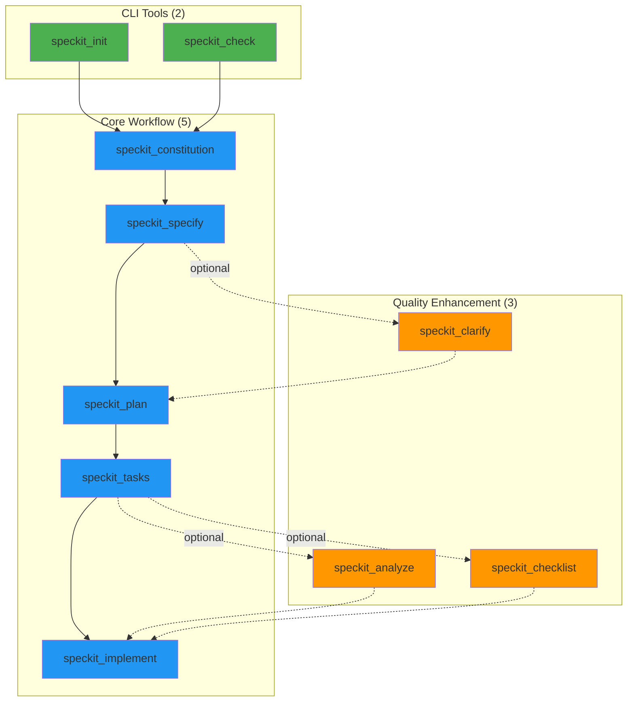

---

## 🛠️ Tool Reference

### 1️⃣ speckit_init

<div align="center">

**Initialize a New Spec-Kit Project**

🔧 _Type: CLI Tool_ | 🎯 _Runs: `uvx specify init`_

</div>

#### Parameters

```json
{
  "project_name": "my-project", // Required: Project name
  "project_path": "." // Optional: Where to create (default: ".")
}
```

#### What It Does

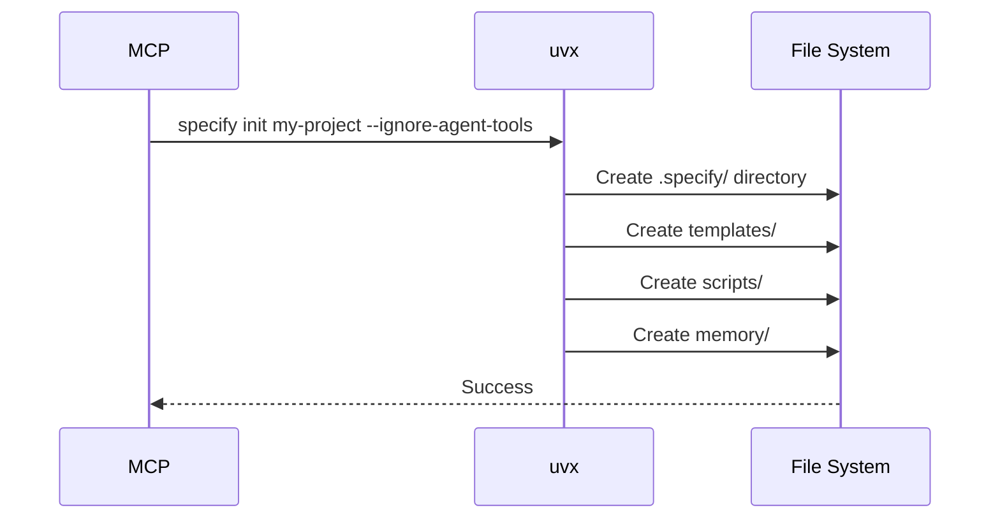

#### Example Usage

```
Use speckit_init with project_name="todo-app" and project_path="."
```

#### Output

```
✅ Successfully initialized spec-kit project 'todo-app' at .

Next steps:
1. Navigate to the project: cd .
2. Create constitution: Use speckit_constitution tool
3. Define requirements: Use speckit_specify tool
```

#### Creates

```
.specify/
├── memory/
├── scripts/
├── specs/
└── templates/
```

---

### 2️⃣ speckit_check

<div align="center">

**Verify Development Environment**

🔧 _Type: CLI Tool_ | 🎯 _Runs: `uvx specify check`_

</div>

#### Parameters

```json
{
  "check_speckit": true, // Optional: Check for spec-kit CLI (default: true)
  "check_git": true, // Optional: Check for git (default: true)
  "check_ai_tools": true // Optional: Check for AI assistants (default: true)
}
```

#### What It Does

Verifies that all required tools are installed and ready to use.

#### Example Usage

```
Use speckit_check to verify my development environment
```

#### Output

```
✅ uv/uvx is available
✅ Spec-kit can be run via: uvx --from git+https://github.com/github/spec-kit.git specify
✅ git is available
✅ All required tools are installed!

You're ready to use spec-kit for spec-driven development.
```

---

### 3️⃣ speckit_constitution

<div align="center">

**Create Project Governing Principles**

📝 _Type: Workflow Tool_ | 💾 _Creates: File_

</div>

#### Parameters

```json
{
  "principles": "Simplicity, Performance, Security", // Required: Core principles
  "constraints": "Must support Python 3.11+", // Optional: Technical constraints
  "output_path": "./speckit.constitution" // Optional: Output path
}
```

#### What It Does

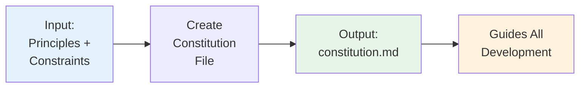

Creates a constitution file that defines:

- 🎯 Core principles
- 🔒 Technical constraints
- 📏 Development standards
- ⚖️ Decision-making guidelines

#### Example Usage

```
Use speckit_constitution with:
- principles: "Code quality, Test coverage, User experience, Performance"
- constraints: "Must work offline, No external dependencies, Python 3.11+"
- output_path: ".specify/memory/constitution.md"
```

#### Output File

```markdown
# Project Constitution

## Core Principles

Code quality, Test coverage, User experience, Performance

## Technical Constraints

Must work offline, No external dependencies, Python 3.11+
```

#### When to Use

- ✅ **First step** after initialization
- ✅ Before defining requirements
- ✅ When starting any new project
- ✅ To document existing project standards

---

### 4️⃣ speckit_specify

<div align="center">

**Define Requirements and User Stories**

📝 _Type: Workflow Tool_ | 💾 _Creates: File_ | 🎯 _Defines: WHAT to build_

</div>

#### Parameters

```json
{
  "requirements": "User authentication with OAuth2", // Required: Requirements
  "user_stories": "As a user, I want to...", // Optional: User stories
  "output_path": "./speckit.specify", // Optional: Output path
  "format": "markdown" // Optional: markdown/yaml/json
}
```

#### What It Does

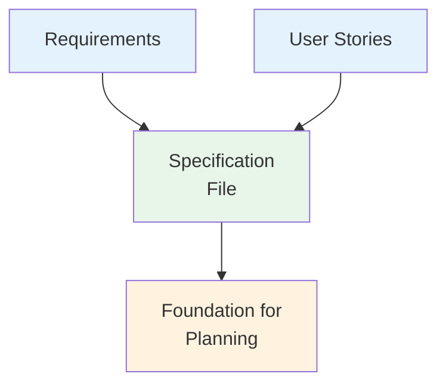

#### Example Usage

```
Use speckit_specify with:
- requirements: "CLI tool to manage tasks: add, list, complete, delete. Persist to JSON file."
- user_stories: "As a user, I want to add tasks so I can track my work. As a user, I want to list tasks so I can see what needs to be done."
- output_path: "./speckit.specify"
```

#### Output File

```markdown
# Specification

## Requirements

CLI tool to manage tasks: add, list, complete, delete. Persist to JSON file.

## User Stories

As a user, I want to add tasks so I can track my work.
As a user, I want to list tasks so I can see what needs to be done.
```

#### Best Practices

<table>
<tr>
<th>✅ Do</th>
<th>❌ Don't</th>
</tr>
<tr>
<td>

- Be specific about features
- Include user stories
- Define acceptance criteria
- Focus on WHAT, not HOW

</td>
<td>

- Mention tech stack
- Include implementation details
- Be vague or ambiguous
- Skip user stories

</td>
</tr>
</table>

---

### 5️⃣ speckit_plan

<div align="center">

**Create Technical Implementation Plan**

📝 _Type: Workflow Tool_ | 💾 _Creates: File_ | 🎯 _Defines: HOW to build_

</div>

#### Parameters

```json
{
  "spec_file": "./speckit.specify", // Required: Path to specification
  "tech_stack": "Python + FastAPI", // Optional: Technology stack
  "output_path": "./speckit.plan" // Optional: Output path
}
```

#### What It Does

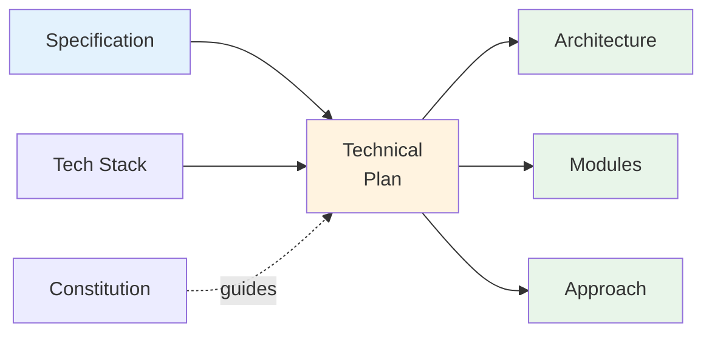

Transforms requirements into technical design:

- 🏗️ Architecture and system design
- 🛠️ Technology stack and frameworks
- 📦 Module breakdown
- 🔄 Implementation approach
- 📊 Data models

#### Example Usage

```
Use speckit_plan with:
- spec_file: "./speckit.specify"
- tech_stack: "Python with argparse for CLI, JSON for storage"
- output_path: "./speckit.plan"
```

#### Output File

```markdown
# Technical Implementation Plan

## Based on Specification

Source: ./speckit.specify

## Architecture

[AI fills in architecture details based on requirements]

## Technology Stack

Python with argparse for CLI, JSON for storage

## Implementation Approach

[AI details the step-by-step approach]

## Module Breakdown

[AI breaks down into components/modules]

## Specification Reference

[Includes the original specification]
```

---

### 6️⃣ speckit_tasks

<div align="center">

**Generate Actionable Task List**

📝 _Type: Workflow Tool_ | 💾 _Creates: File_ | 🎯 _Breaks down: Implementation_

</div>

#### Parameters

```json
{
  "plan_file": "./speckit.plan", // Required: Path to plan
  "breakdown_level": "medium", // Optional: high/medium/detailed
  "output_path": "./speckit.tasks" // Optional: Output path
}
```

#### Breakdown Levels

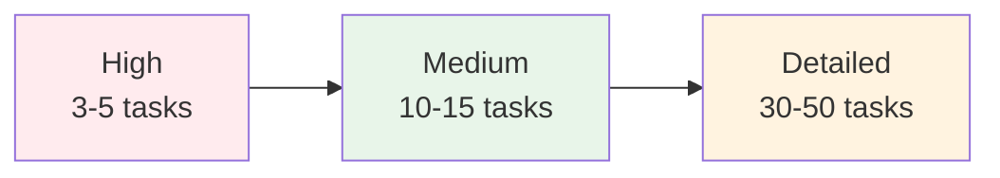

<table>
<tr>
<th>Level</th>
<th>Tasks</th>
<th>Best For</th>
</tr>
<tr>
<td><b>high</b></td>
<td>3-5 major milestones</td>
<td>Quick prototypes, simple projects</td>
</tr>
<tr>
<td><b>medium</b></td>
<td>10-15 manageable tasks</td>
<td>Most projects (recommended)</td>
</tr>
<tr>
<td><b>detailed</b></td>
<td>30-50 granular tasks</td>
<td>Complex projects, team coordination</td>
</tr>
</table>

#### Example Usage

```
Use speckit_tasks with:
- plan_file: "./speckit.plan"
- breakdown_level: "medium"
- output_path: "./speckit.tasks"
```

#### Output File

```markdown
# Task List

## Based on Plan

Source: ./speckit.plan
Breakdown Level: medium

## Tasks

### Phase 1: Core Structure

- [ ] Create Task class with id, description, completed fields
  - Acceptance: Task object can be created and serialized
  - Dependencies: None
  - Estimated effort: 30 minutes

- [ ] Implement TaskManager class with CRUD methods
  - Acceptance: Can add, list, update, delete tasks
  - Dependencies: Task class
  - Estimated effort: 1 hour

[... more tasks ...]
```

---

### 7️⃣ speckit_implement

<div align="center">

**Execute Implementation**

📝 _Type: Workflow Tool_ | 💻 _Guides: Code Generation_

</div>

#### Parameters

```json
{
  "task_file": "./speckit.tasks", // Required: Path to tasks
  "context": "Use async/await", // Optional: Additional context
  "output_dir": "./src" // Optional: Where to generate code
}
```

#### What It Does

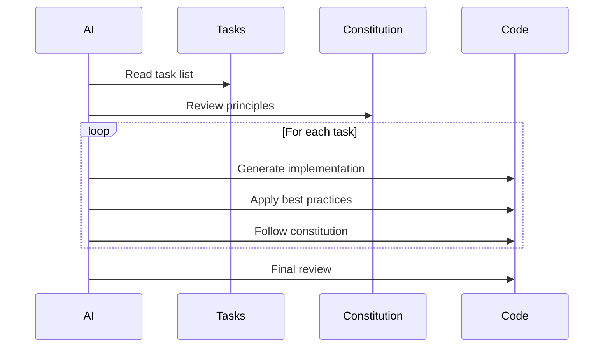

#### Example Usage

```
Use speckit_implement with:
- task_file: "./speckit.tasks"
- context: "Follow PEP 8 style guide, add docstrings, use type hints"
- output_dir: "./"
```

#### What the AI Does

1. 📖 Reads the task list
2. 📜 Reviews the constitution
3. 💻 Generates code for each task
4. ✅ Follows best practices
5. 🧪 Adds error handling
6. 📝 Includes documentation

---

### 8️⃣ speckit_clarify

<div align="center">

**Identify Underspecified Areas**

📝 _Type: Workflow Tool_ | 💾 _Creates: File_ | 🎯 _Optional: Quality Enhancement_

</div>

#### Parameters

```json
{
  "spec_file": "./speckit.specify", // Required: Path to specification
  "questions": ["How to handle..."], // Optional: Specific questions
  "output_path": "./speckit.clarify" // Optional: Output path
}
```

#### When to Use

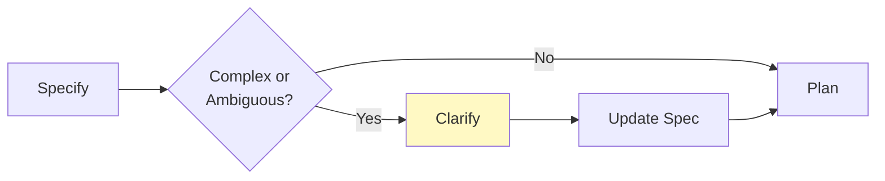

**Use when:**

- ✅ Requirements are complex
- ✅ Multiple interpretations possible
- ✅ Edge cases unclear
- ✅ Before creating technical plan

#### Example Usage

```
Use speckit_clarify with:
- spec_file: "./speckit.specify"
- output_path: "./speckit.clarify"
```

#### Output

```markdown
# Clarification Questions

## Underspecified Areas

### 1. Search Functionality

**Question:** Should search be case-sensitive or case-insensitive?
**Impact:** Affects user experience and implementation complexity

### 2. Data Validation

**Question:** What's the maximum length for task descriptions?
**Impact:** Database schema and validation logic

### 3. Error Handling

**Question:** How should we handle file permission errors?
**Impact:** User experience and error messages

[... more questions ...]
```

---

### 9️⃣ speckit_analyze

<div align="center">

**Analyze Cross-Artifact Consistency**

📝 _Type: Workflow Tool_ | 💾 _Creates: Report_ | 🎯 _Optional: Quality Enhancement_

</div>

#### Parameters

```json
{
  "project_path": ".", // Required: Project directory
  "check_consistency": true, // Optional: Check consistency
  "check_coverage": true, // Optional: Check coverage
  "output_path": "./speckit.analyze" // Optional: Output path
}
```

#### What It Checks

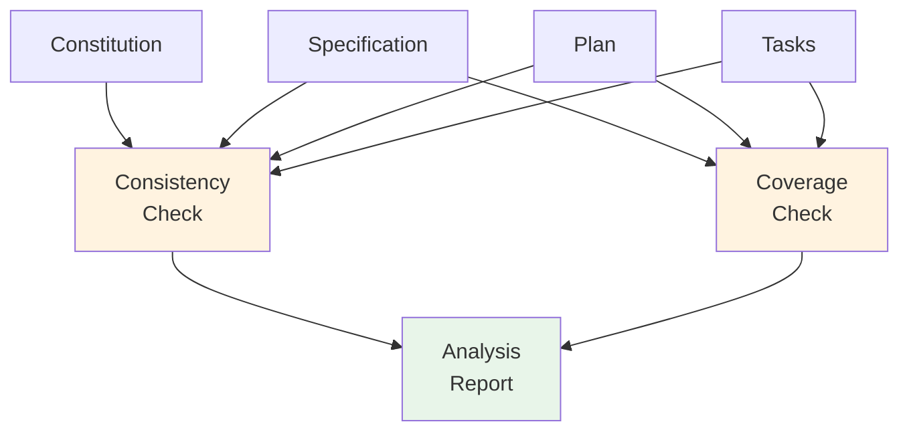

**Checks:**

- ✅ Constitution principles reflected in plan
- ✅ All requirements covered in plan
- ✅ All plan items have tasks
- ✅ No orphaned tasks
- ✅ Technical constraints satisfied

#### When to Use

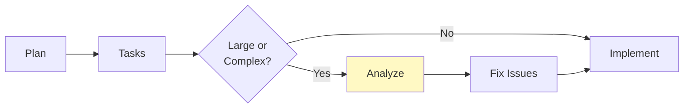

#### Example Usage

```
Use speckit_analyze with:
- project_path: "."
- check_consistency: true
- check_coverage: true
```

#### Output

```markdown
# Analysis Report

## Consistency Check

✅ Constitution principles are reflected in the plan
✅ All requirements from spec are covered in plan
✅ Technical constraints are satisfied
⚠️ Consider adding rate limiting (not in requirements)

## Coverage Check

✅ All user stories have corresponding tasks
✅ All plan modules have implementation tasks
❌ Missing: Error handling for network failures

## Recommendations

1. Add error handling tasks
2. Consider rate limiting for API endpoints
3. Add logging strategy to plan
```

---

### 🔟 speckit_checklist

<div align="center">

**Generate Validation Checklist**

📝 _Type: Workflow Tool_ | 💾 _Creates: File_ | 🎯 _Optional: Quality Enhancement_

</div>

#### Parameters

```json
{
  "spec_file": "./speckit.specify", // Required: Path to specification
  "include_implementation": true, // Optional: Include impl checks
  "include_testing": true, // Optional: Include test checks
  "output_path": "./speckit.checklist" // Optional: Output path
}
```

#### What It Creates

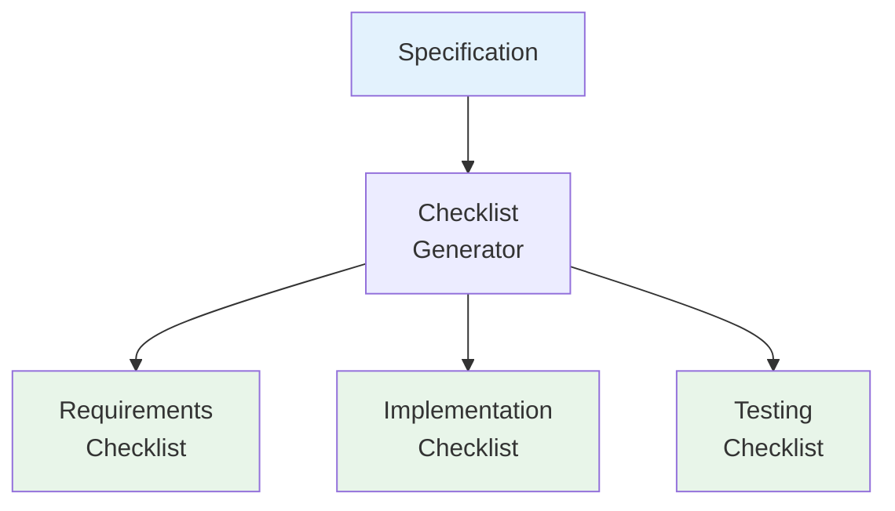

#### When to Use

- ✅ Before implementation (as a guide)
- ✅ After implementation (for validation)
- ✅ For code reviews
- ✅ For QA testing

#### Example Usage

```
Use speckit_checklist with:
- spec_file: "./speckit.specify"
- include_implementation: true
- include_testing: true
```

#### Output

```markdown
# Validation Checklist

## Requirements Validation

- [ ] Users can add tasks with descriptions
- [ ] Users can list all tasks
- [ ] Users can mark tasks as complete
- [ ] Users can delete tasks
- [ ] Tasks persist to JSON file

## Implementation Validation

- [ ] Code follows constitution principles
- [ ] Error handling is comprehensive
- [ ] Input validation is present
- [ ] Code is documented

## Testing Validation

- [ ] Unit tests for Task class
- [ ] Unit tests for TaskManager
- [ ] Integration tests for CLI
- [ ] Edge cases are tested
```

---

## 🔄 Workflow Patterns

### Pattern 1: Quick Prototype


**Steps:** 5 | **Time:** ~20 min | **Best for:** MVPs, hackathons, exploration

---

### Pattern 2: Production Feature


**Steps:** 9 | **Time:** ~45 min | **Best for:** Production code, team projects

---

### Pattern 3: Legacy Refactoring

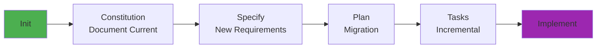

**Steps:** 6 | **Time:** ~30 min | **Best for:** Modernizing legacy code

---

## 📁 File Structure

After using the tools, your project will have:

```
my-project/
├── .specify/                    # Spec-kit directory
│   ├── memory/
│   │   └── constitution.md      # ← speckit_constitution
│   ├── scripts/                 # Helper scripts
│   ├── specs/                   # Feature specifications
│   │   └── 001-feature/
│   │       ├── spec.md
│   │       ├── plan.md
│   │       └── tasks.md
│   └── templates/               # Spec-kit templates
│
├── speckit.specify              # ← speckit_specify
├── speckit.plan                 # ← speckit_plan
├── speckit.tasks                # ← speckit_tasks
├── speckit.clarify              # ← speckit_clarify (optional)
├── speckit.analyze              # ← speckit_analyze (optional)
├── speckit.checklist            # ← speckit_checklist (optional)
│
└── src/                         # ← speckit_implement
    ├── main.py
    ├── models.py
    └── utils.py
```

---

## 💡 Tips & Tricks

### 🎯 Tip 1: Always Initialize First

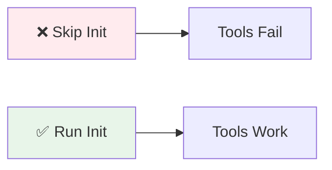

**Why:** All tools expect the `.specify/` directory to exist.

---

### 🔍 Tip 2: Check Before You Start

```bash
# First thing every session
Use speckit_check to verify my environment
```

**Catches:**

- Missing `uv`/`uvx`
- Git not installed
- Environment issues

---

### 📝 Tip 3: Constitution is King

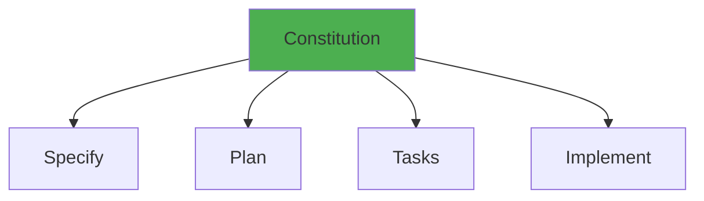

**Everything flows from the constitution!**

---

### ❓ Tip 4: Clarify Complex Requirements

<table>
<tr>
<th>Complexity</th>
<th>Use Clarify?</th>
</tr>
<tr>
<td>Simple CRUD app</td>
<td>❌ Skip</td>
</tr>
<tr>
<td>API with auth</td>
<td>⚠️ Maybe</td>
</tr>
<tr>
<td>Distributed system</td>
<td>✅ Definitely</td>
</tr>
</table>

---

### 🔍 Tip 5: Analyze Large Projects

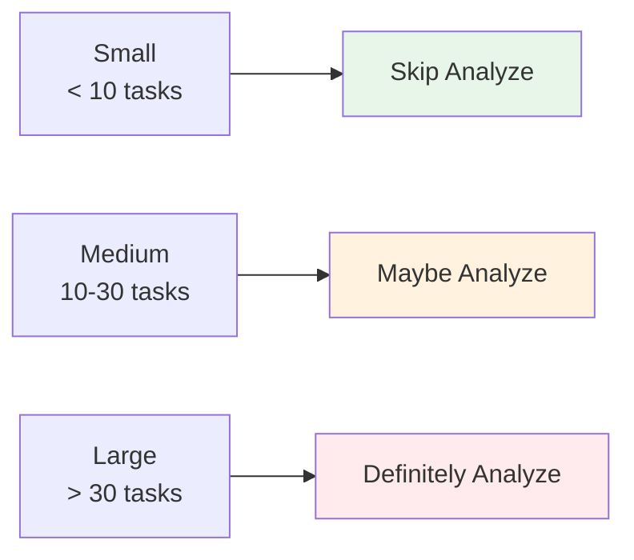

---

### ✅ Tip 6: Checklist for Critical Features

Use `speckit_checklist` when:

- 🏥 Production-critical features
- 👥 Team collaboration
- 📋 Compliance requirements
- 🔒 Security features

---

## 🆘 Quick Reference

### Command Cheat Sheet

```bash
# Setup
speckit_init          # Initialize project
speckit_check         # Verify environment

# Core Workflow
speckit_constitution  # Define principles
speckit_specify       # Define requirements
speckit_plan          # Create technical plan
speckit_tasks         # Generate task list
speckit_implement     # Execute implementation

# Quality Enhancement
speckit_clarify       # Identify ambiguities
speckit_analyze       # Check consistency
speckit_checklist     # Generate validation
```

### Decision Tree

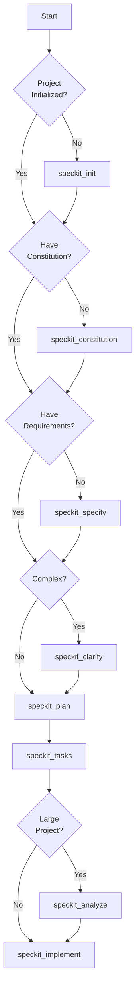

---

<div align="center">

## 🎉 You're All Set!

**Ready to build amazing things with spec-driven development!**

[📖 Tutorials](./TUTORIALS.md) • [🏠 Main README](./README.md) • [🔗 Official Spec-Kit](https://github.com/github/spec-kit)

[⬆ Back to Top](#-spec-kit-mcp-usage-guide)

</div>
